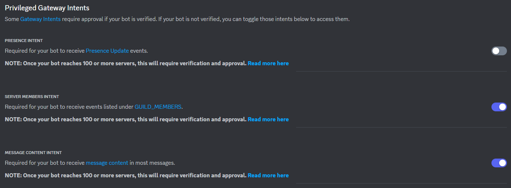

<!-- omit in toc -->
# 特徴
## 外部ツール・バージョン非依存

プラグイン・Modが不要で任意のバージョンで動作します

バニラ・Forge・Spigot・Paperなどの好きなバージョンでお使いいただけます

## 見やすいログ表示

Minecraft内で送信したメッセージは設定したアイコン・表示名でDiscordに送信されます

デフォルトではアイコンはスキンの顔、表示名はMCIDが使われます

## Discordからのサーバー操作

DiscordからMinecraftに向けてコマンドを送信することができます

また事前に設定したコマンドを用いてサーバーで実行することもできます

<!-- omit in toc -->
# 目次
- [インストール](#インストール)
  - [Javaのインストール](#javaのインストール)
  - [RCONの設定](#rconの設定)
  - [Webhookの追加](#webhookの追加)
  - [Botアカウントの設定](#botアカウントの設定)
  - [設定](#設定)
  - [実行](#実行)
- [コマンド一覧](#コマンド一覧)
  - [設定コマンド](#設定コマンド)
  - [システムコマンド](#システムコマンド)
  - [コンソールコマンド](#コンソールコマンド)
- [コンタクト](#コンタクト)
- [高度な設定](#高度な設定)


# インストール
## Javaのインストール
Minecraftサーバーの起動にJavaが必要なためほとんどの場合すでにインストールされていると思いますが、していない場合はJavaをインストールします

なお、Java8以上が必要です

## RCONの設定
サーバーの設定ファイルであるserver.propertiesに以下の項目を追記します
```
enable-rcon=true
rcon.port=25575(好きなもので大丈夫ですが、通常は25575を使用します)
rcon.password=password(好きなものを設定してください)
```

## Webhookの追加
ログを送信したいチャンネルを右クリックし、「チャンネルの編集」をクリックします

編集メニューの「連携サービス」を選択し、「ウェブフック」を選択します

ウェブフックメニューの「新しいウェブフック」をクリックし、追加されたBotを選択します

「ウェブフックURLをコピー」を押し、保存しておきます

なお、このURLによって外部からDiscordサーバーにメッセージを送信することが可能になるため、**他人に教えたりせず、取り扱いには十分注意してください**

名前やアイコンは[設定](#設定)の欄からも設定できます

どちらでも動作は変わらないですが、画像ファイルが存在する場合はここで設定すると別途アップロードする必要がなくなります

なお、名前やアイコンはsettings.propertiesの設定のほうが優先されるので、ここで設定した場合はsettings.propertiesの`systemAvatorUrl`・`systemName`は空欄にしてください

## Botアカウントの設定
https://discordpy.readthedocs.io/ja/latest/discord.html

このページを参考に、Botアカウントを作成してください

なお、ページ内では書かれていませんが「Botアカウント作成」の6番で名前やアイコンの設定をし、その下にある`SERVER MEMBERS INTENT`、`MESSAGE CONTENT INTENT`をオンにします

お好みで[デフォルトアイコン](images/Loglin_icon_white.png)をご利用ください

また、7番でコピーするトークンによってBotを操作することが可能になるため、**他人に教えたりせず、取り扱いには十分注意してください**

「Botを招待する」の6番で必要な権限は以下の通りです

- Read Messages/View Channels
- Send Messages

URLの最後のほうに`permissions=3072`と書かれていれば権限は正しく設定できています

## 設定
初回実行時に設定ファイルなど必要なファイルが生成されるため、一度[実行](#実行)の欄を参考に実行します

実行後、同じフォルダ内に生成されたsettings.propertiesを編集します

それぞれの項目は以下の通りです

なお、記入方法はMinecraftのserver.propertiesと同じです

また、補足に書かれている「空欄」というのは「=」以降に何も入力しないということであり、「=」の前の文字列は残したままにしてください

(例)commandChannelIdを空欄にする場合：`commandChannelId=`

さらに、システムログを送信する際に使われるアイコンはURLでの指定になっていますが、一度Discordで適当なチャンネルに送信し、その画像を右クリックして「リンクをコピー」を選択してURLを得る方法が最も簡単です

チャンネルやロールのIDなどは以下のページを参考に取得してください

https://support.discord.com/hc/ja/articles/206346498-%E3%83%A6%E3%83%BC%E3%82%B6%E3%83%BC-%E3%82%B5%E3%83%BC%E3%83%90%E3%83%BC-%E3%83%A1%E3%83%83%E3%82%BB%E3%83%BC%E3%82%B8ID%E3%81%AF%E3%81%A9%E3%81%93%E3%81%A7%E8%A6%8B%E3%81%A4%E3%81%91%E3%82%89%E3%82%8C%E3%82%8B-


|項目名|説明|補足|必須|
| --- | --- | --- | --- |
|password|RCONのパスワード|取り扱いには十分注意してください|○|
|token|Botのトークン|取り扱いには十分注意してください|○|
|url|WebhookのURL|取り扱いには十分注意してください|○|
|hostIp|Minecraftのサーバーのアドレス|同じサーバーで動作させる場合はlocalhostを指定します|○|
|port|RCONのポート|server.propertiesで設定したものと同じものにしてください|○|
|logFile|Minecraftのログファイルのパス|latest.logがあるファイルへのパスを指定します<br>バックスラッシュ(もしくは円マーク)は二つ重ねる必要があります<br>例：C:\\\\Users\\\\yadokari\\\\Desktop\\\\server\\\\logs|○|
|dbPath|ログイン記録のデータベースファイルのパス|空欄でログイン履歴を記録しないようになります|×|
|systemAvatarUrl|BotのアイコンのURL|プレイヤー以外によるシステムログを送信するときに使われます<br>空欄で[Webhookの追加](#webhookの追加)の欄で設定したアイコンが使われます|×|
|systemName|Botの表示名|プレイヤー以外によるシステムログを送信するときに使われます<br>空欄で[Webhookの追加](#webhookの追加)の欄で設定した名前が使われます|×|
|isChangeUserColor|DiscordのメッセージをMinecraftに送信する際にDiscordの表示色に変更するか|true/falseで設定してください|○|
|commandChar|コマンドの前につける文字|設定コマンドとシステムコマンドで共通です|○|
|commandChannelId|システムコマンドを受け付けるチャンネルID|空欄ですべてのチャンネルでシステムコマンドを受け付けます|×|
|commandRoleId|システムコマンドを実行するために必要なロールID|空欄ですべての人がシステムコマンドを実行できるようになります<br>**サーバーに影響を及ぼすことができるため、設定することを推奨します**|×|
|settingChannelId|アイコン/表示名を変更するコマンドを受け付けるチャンネルID|空欄ですべてのチャンネルで設定コマンドを受け付けます|×|
|settingRoleId|アイコン/表示名を変更するコマンドを実行するために必要なロールID|空欄ですべての人が設定コマンドを実行できるようになります|×|
|textChannelId|Minecraftにメッセージを送信するチャンネル|このチャンネルに送信されたメッセージがMinecraftに送信され、Minecraftで送信されたメッセージがこのチャンネルに送信されます|×|
|textRoleId|DiscordのメッセージをMinecraftに送信するために必要なロールID|このロールを持つ人が送信したメッセージのみがMinecraftに送信されます<br>空欄ですべての人のメッセージがMinecraftに送信されます|×|
|before||システム内部で使用する値のため、**変更しないでください**|○|

デフォルト設定
```
password=
token=
url=
hostName=localhost
port=25575
logFile=
sqlitePath=login_data.db
systemAvatarUrl=https://github.com/yadokari1130/Loglin/blob/master/images/Loglin_icon_white.png?raw=true
systemName=Loglin
isChangeUserColor=true
commandChar=!
commandChannelId=
commandRoleId=
settingChannelId=
settingRoleId=
textChannelId=
textRoleId=
before=0
```

## 実行
`java -jar Loglin-<version>.jar`で実行できます

「Loglin-\<version\>.jar」の部分はファイル名が入ります

# コマンド一覧
ここではコマンドの前につける文字を「!」としますが、適宜設定した文字に読み替えてください

## 設定コマンド
これらのコマンドを使用するためには`settingChannelId`で設定したチャンネル内で`settingRoleId`のロールを持つ人が実行する必要があります
### `!getid`
ログで使用する画像や名前を設定するためのIDを取得します

アイコンや名前を変更する前にこのコマンドを実行し、DiscordアカウントとMinecraftアカウントの紐づけを行ってください

### `!seticon <画像>`
ログで使用するアイコンを設定します

画像と共に`!seticon`と送信することで、その画像に設定することができます

### `!seticon <URL>`
ログで使用するアイコンを設定します

Discordに画像を送信せず、URLを直接指定することで、その画像に設定することができます

### `!seticon`
設定したアイコンを削除し、Minecraftのスキンを使用します

### `!setname <名前>`
ログで使用する名前を設定します

### `!setname`
設定した名前を削除し、MCIDを使用します

## システムコマンド
これらのコマンドを使用するためには`commandChannelId`で設定したチャンネル内で`commandRoleId`のロールを持つ人が実行する必要があります
### `!mccommand <コマンド>`
Minecraft内で指定したコマンドを実行します

## コンソールコマンド
Minecraftサーバーと同様に、実行中のコンソールから実行できるコマンドです

なお、コマンドの前に文字をつける必要はありません

### `mc <コマンド>`
Minecraft内で指定したコマンドを実行します

### `dc <メッセージ>`
Discordにメッセージを送信します

# コンタクト
不具合があった場合、GitHubアカウントをお持ちの方はIssueをたててください

GitHubアカウントがない方やその他質問などはTwitterアカウント([@Y4D0K4R1](https://twitter.com/Y4D0K4R1))までご連絡ください

その際、Loglin・Minecraftサーバーの詳細なバージョンやlatest.log、`token`・`url`を削除したsettings.propertiesなどを添付していただけると助かります

# 高度な設定
高度な設定はサーバー機本体に影響を及ぼすことが可能になります

そのため**十分な知識を持った方のみ以下の設定を行ってください**

なお、コマンドの前につける文字を他のBotと同じものにしたい場合、他のBotのコマンドを実行する際に「コマンドが見つかりませんでした」というエラーメッセージが表示される場合があります

そのエラーメッセージを表示させたくない場合、[他のBotに存在するコマンド](/ADVANCED_SETTINGS.md#他のbotに存在するコマンド)の欄をご覧ください

### [詳細リンク](/ADVANCED_SETTINGS.md)